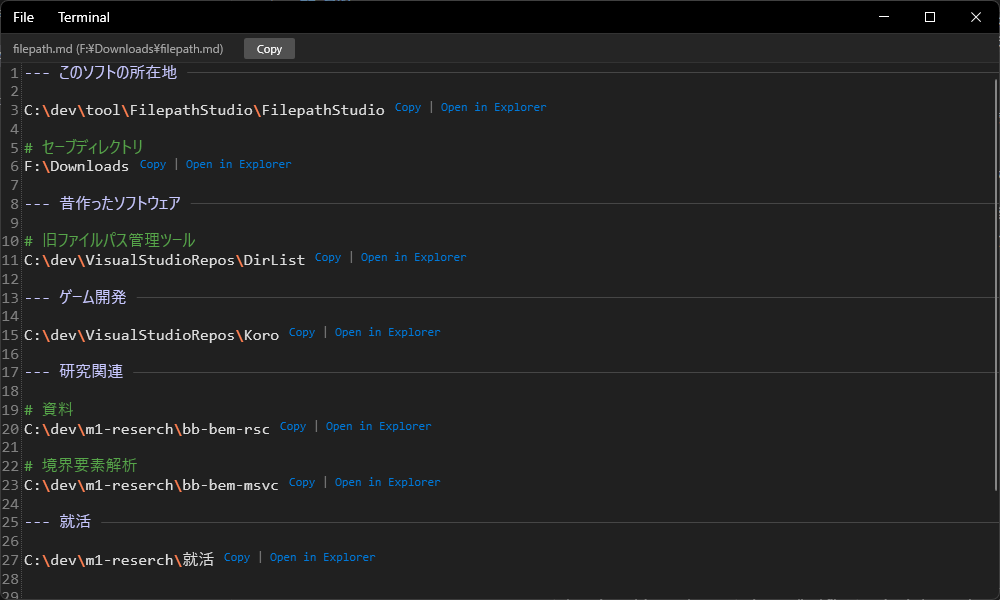

# FilepathStudio

ファイルパスの管理と活用を劇的にスムーズにする、開発者のための軽量・爆速なツールです。

## 開発の背景

これは実験的なプロジェクトです。コードの大部分は、AI アシスタント **Antigravity** と **Gemini 3 Flash** モデルによって爆速で組み上げられました。

## 概要

FilepathStudio は、ファイルシステムのパスを Markdown に似た直感的な形式で整理・管理できる WPF アプリケーションです。
テキスト内のパスを自動検出し、タイトルバーやエディタ内からワンクリックでコピーしたり、エクスプローラーで開いたりすることができます。

## 主な機能

- **パスの自動検出とアクション**: 
  - テキスト内の絶対パスを自動検出し、「Copy | Open in Explorer」リンクをリアルタイムで横に表示します。
- **スタイリッシュなエディタ**:
  - `#` によるセクション分け（自動カラーリング）。
  - `---` による水平セパレーターの描画。
  - ダークモードを基調としたモダンで目に優しい UI。
- **効率的な操作**:
  - **ズーム機能**: `Ctrl + マウスホイール` でフォントサイズを即座に変更。
  - **検索・置換**: `Ctrl + F` / `Ctrl + H` で強力なテキスト操作が可能。
  - **ターミナル連携**: 現在開いているファイルのディレクトリで素早くターミナルを起動。
- **堅牢なファイル操作**:
  - ショートカットキー対応（`Ctrl + S`, `Ctrl + Shift + S` など）。
  - 未保存の変更がある場合の終了前確認アラート。

---
